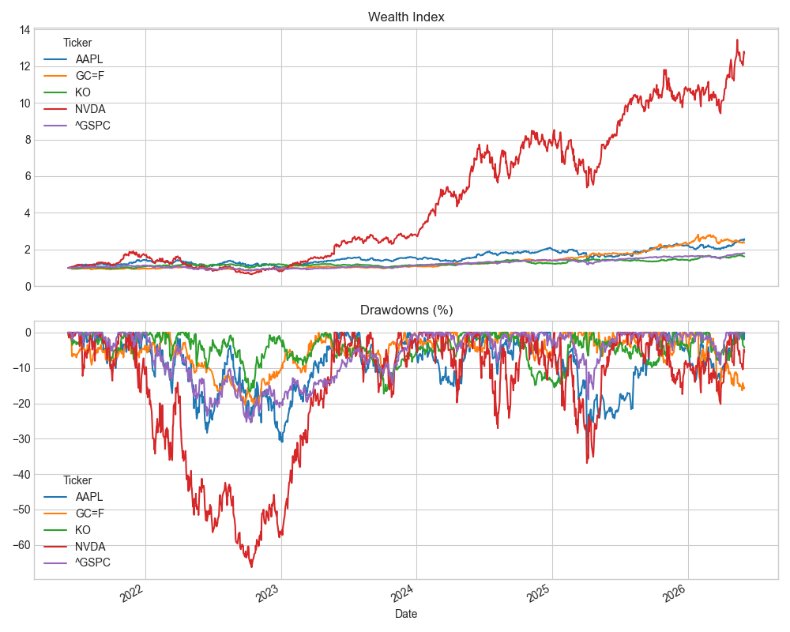
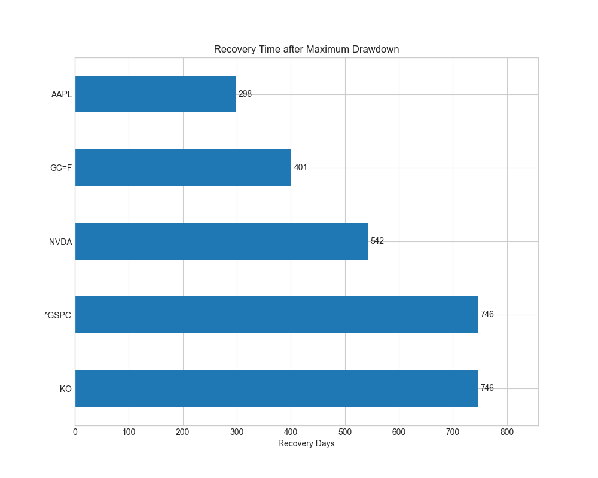
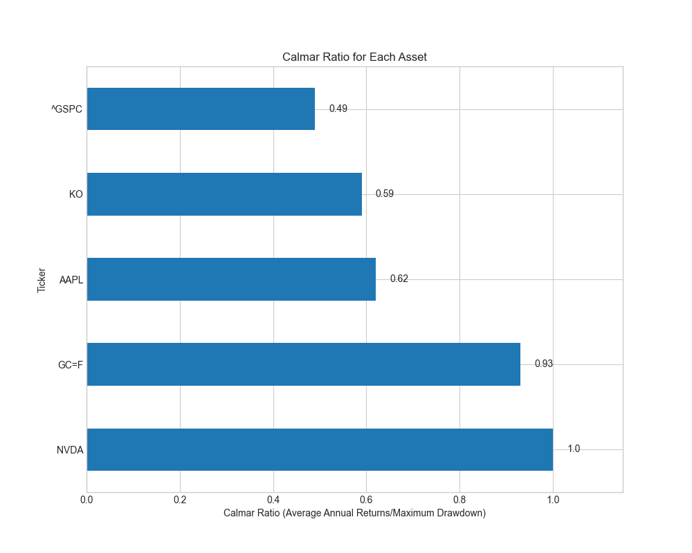
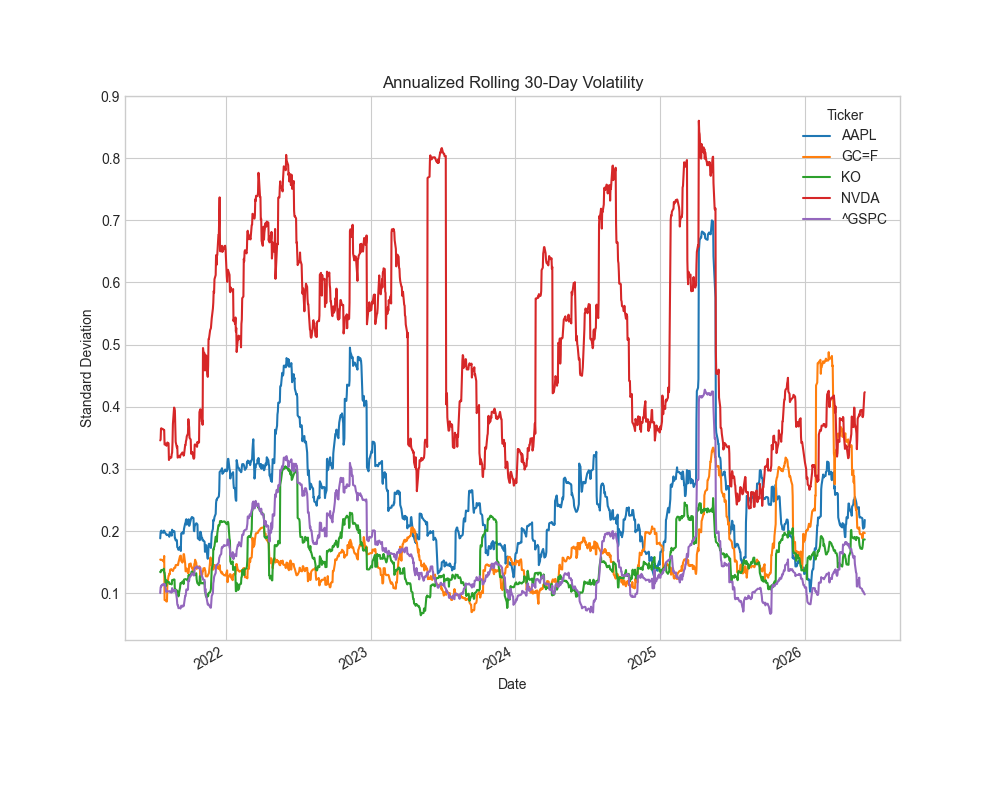
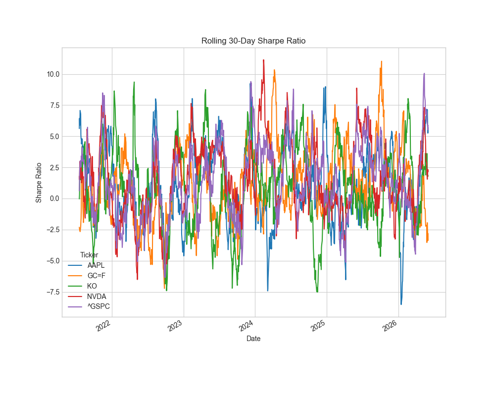

# Dynamic Risk & Drawdown Analytics

## Overview

This project analyzes the risk characteristics and drawdown behavior of multiple assets over the past 5 years using Python.

Rather than focusing solely on returns, the project examines how assets behave during different market conditions by measuring drawdowns, recovery periods, volatility, and risk-adjusted performance.

Assets analyzed:

* Apple (AAPL)
* NVIDIA (NVDA)
* Coca-Cola (KO)
* Gold Futures (GC=F)
* S&P 500 Index (^GSPC)

---

## Objectives

* Measure long-term growth using a Wealth Index
* Analyze historical drawdowns
* Identify Maximum Drawdowns
* Calculate Recovery Duration after major declines
* Evaluate changing risk through Rolling Volatility
* Measure dynamic risk-adjusted performance using Rolling Sharpe Ratios
* Compare downside-risk-adjusted returns using the Calmar Ratio

---

## Metrics Used

### Wealth Index

Tracks the growth of $1 invested over the analysis period.

### Drawdown

Measures the percentage decline from the previous peak.

### Maximum Drawdown

Largest peak-to-trough decline experienced by an asset.

### Recovery Duration

Number of days required to recover from the worst drawdown and return to the previous peak.

### Annualized Rolling Volatility

30-day rolling volatility annualized using 252 trading days.

### Rolling Sharpe Ratio

30-day rolling risk-adjusted performance metric.

### CAGR (Compound Annual Growth Rate)

Annualized growth rate of an investment over the full period.

### Calmar Ratio

Measures return generated per unit of maximum drawdown risk.

---

## Key Findings

### NVIDIA

* Highest CAGR among analyzed assets
* Experienced substantial drawdowns
* Required extended recovery periods following major declines

### Gold

* Lower volatility than most equities
* Strong downside protection
* Competitive Calmar Ratio despite lower returns

### S&P 500

* Delivered steady long-term growth
* Experienced prolonged recovery periods during market stress

---

## Visualizations

### Wealth Index and Drawdowns

### Recovery Duration

### Calmar Ratio

### Annualized Rolling Volatility

### Rolling Sharpe Ratio

---

## Tools Used

* Python
* Pandas
* NumPy
* Matplotlib
* yfinance

---

